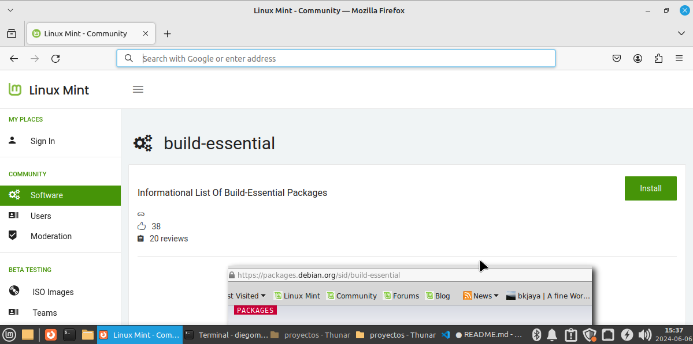
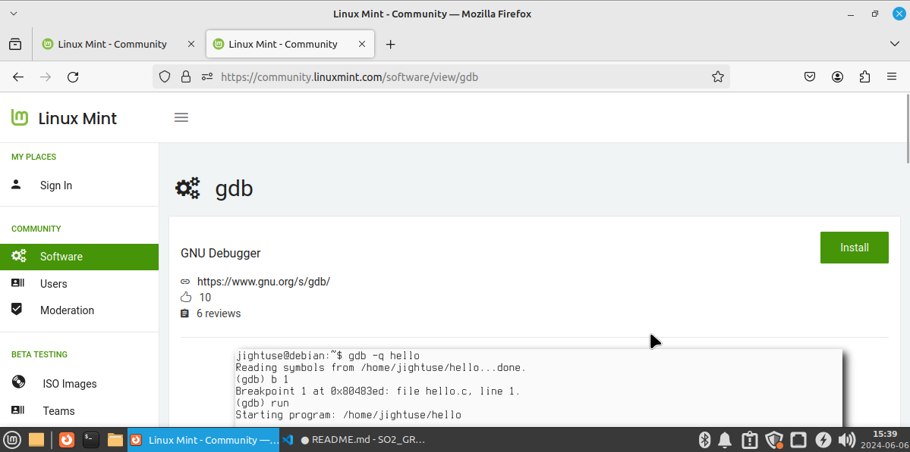

# Sistemas Operativos 2
# Practica 1

# Manual Técnico

## Instalaciones previas

### Linux Mint build-essential
https://community.linuxmint.com/software/view/build-essential



### Linux Mint gdb
https://community.linuxmint.com/software/view/gdb




## Adicional para STAP

```
sudo apt-get update
sudo apt-get install systemtap
```

### Verificación stap

`stap -V`

## Proceso para ejecutar

### Crear bin hijo

`gcc son.c -o son`

### Crear bin padre

`gcc father.c -o father`

### Ejecutar stp
`sudo stap monitor.stp`

### Ejecutar padre (carpeta raíz)
`./father`

## Proceso father

- **Creación de Procesos Hijo**: Utiliza fork() para crear dos procesos hijo.
 ```c
  pid_t proceso_hijo = fork();
  if (proceso_hijo == -1) {
      perror("fork");
      exit(1);
  }
```

- **Ejecución de Procesos Hijo**: Utiliza execv() para ejecutar los procesos hijo.
  ```c
  if (proceso_hijo == 0) {
    char *arg_Ptr[4] = {"son.bin", " Hola! ", " Soy el proceso hijo! ", NULL};
    execv("/path/to/son.bin", arg_Ptr);
    perror("execv");
    exit(1);
}

  ``

- **Monitoreo**: Monitorea las llamadas al sistema de los procesos hijo y las registra en syscalls.log.
  ```c
  if (proceso_hijo != 0) {
    char command[100];
    sprintf(command, "%s %d %d %s", "sudo stap monitor.stp ", proceso_hijo, proceso_hijo2, " > syscalls.log");
    system(command);
    wait(NULL);
    wait(NULL);
}
  ``

- **Registro de Llamadas**: 
  - Formato del log: `Proceso <<pid>> : <<llamada realizada>> (<<fecha y hora de la llamada>>)`
- **Finalización**: Captura la señal SIGINT (Ctrl + C) y, antes de finalizar, imprime:
  - Número total de llamadas al sistema realizadas por los procesos hijo.
  - Número de llamadas al sistema por tipo (ej.: Read: 2, Write: 5).

## Proceso son

- **Operaciones de Archivo**: Realizan llamadas open, write, y read sobre practica1.txt.
```c
  int archivo = open("practica1.txt", O_RDWR | O_CREAT | O_TRUNC, 0644);
  if (archivo == -1) {
      perror("Error al abrir el archivo");
      exit(EXIT_FAILURE);
  }
```
  
- **Intervalos Aleatorios**: Las llamadas se realizan con intervalos aleatorios de 1 a 3 segundos.
  ```c
  sleep(rand() % 3 + 1);
  ```

## SystemTap

- **Script de Monitoreo**: Intercepta las llamadas al sistema realizadas por los procesos hijo y las registra en el log.
