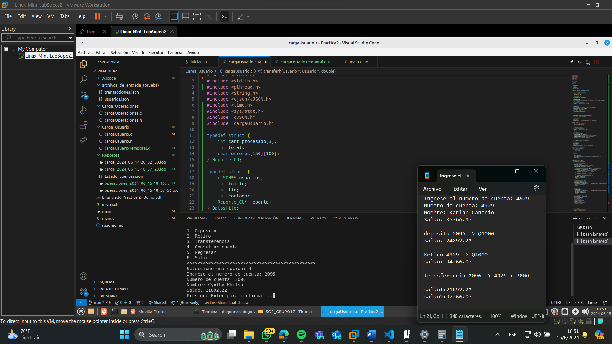
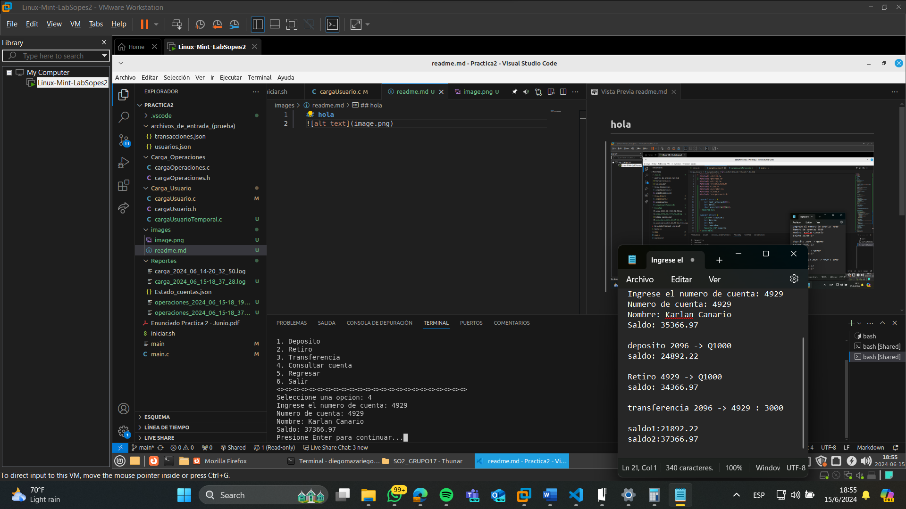
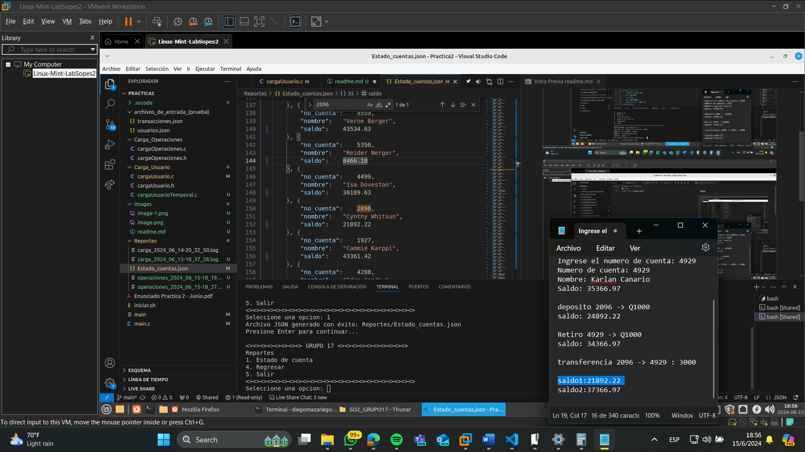

# Proyecto de manejo de Hilos con Carga Masiva de Usuarios y Operaciones

## Descripción

Este proyecto implementa un sistema de carga masiva de operaciones y manejo de usuarios utilizando programación concurrente y paralela. El programa permite realizar operaciones de depósito, retiro, transferencia y consulta de cuentas, y genera reportes detallados de las operaciones realizadas.

## Requisitos del Programa

Para ejecutar este proyecto, es necesario tener instalados los siguientes paquetes en tu sistema Linux:

- `gcc`
- `libcjson-dev`
- `pthread`

### Instalación de Requisitos

Para instalar los paquetes necesarios, ejecuta los siguientes comandos en la terminal:

```bash
sudo apt-get update
sudo apt-get install libcjson-dev
```

### Instrucciones para Ejecutar el Programa

#### Compilar y Ejecutar el Programa:

Para compilar y ejecutar el programa, utiliza el script iniciar.sh. Este script compila el código fuente y, si la compilación es exitosa, ejecuta el programa.

```bash
./iniciar.sh
```

El script iniciar.sh contiene los siguientes comandos:
```bash
#!/bin/bash

gcc -o main main.c Carga_Usuario/cargaUsuario.c Carga_Operaciones/cargaOperaciones.c -lpthread -lcjson -I/usr/include/cjson

# Verificar si la compilación fue exitosa
if [ $? -eq 0 ]; then
    echo "Compilación exitosa. Ejecutando el programa..."
    ./main
else
    echo "Error en la compilación. No se ejecutará el programa."
fi
```
Este script compila los archivos main.c, cargaUsuario.c y cargaOperaciones.c, vinculando las bibliotecas pthread y cjson.


## Estructura del Código

### main.c

El archivo main.c contiene el menú principal del programa, que permite al usuario elegir entre diferentes opciones como cargas masivas, reportes y operaciones individuales. Aquí se muestra un fragmento del código del menú principal:

```C
int main() {
    int opcion;
    do {
        system("clear");
        printf("\n<><><><><><><><> GRUPO 17 <><><><><><><><><><>");
        printf("\nMenu\n");
        printf("1. Cargas masivas\n");
        printf("2. Reportes\n");
        printf("3. Operaciones Individuales\n");
        printf("4. Salir\n");
        printf("<><><><><><><><><><><><><><><><><><><><><><><><>\n");
        printf("Seleccione una opcion: ");
        scanf("%d", &opcion);

        switch (opcion) {
            case 1:
                system("clear");
                mostrarMenuCarga();
                break;
            case 2:
                system("clear");
                mostrarMenuReporte();
                break;
            case 3:
                system("clear");
                mostrarMenuOperacionesIndividuales();
                break;
            case 4:
                printf("Saliendo del programa...\n");
                break;
            default:
                printf("Opcion invalida.\n");
        }
    } while (opcion != 4);

    return 0;
}
```

### Paralelismo en la Carga de Usuarios

La carga de usuarios se realiza de manera secuencial en el archivo cargaUsuario.c. Se utiliza la biblioteca cJSON para parsear el archivo JSON que contiene la información de los usuarios y se almacenan en una lista enlazada.

```C
void cargarUsuarios(const char* rutaArchivo) {
    // ... Código anterior dentro de la función
    
    // Crea hilos y procesa los usuarios
    pthread_t hilos[3];
    DatosHilo datosHilos[3];

    int usuariosPorHilo = cantidadUsuarios / 3;
    int indiceUsuario = 0;

    for (int i = 0; i < 3; i++) {
        datosHilos[i].usuarios = usuarios;
        datosHilos[i].inicio = indiceUsuario;
        datosHilos[i].fin = indiceUsuario + usuariosPorHilo;
        datosHilos[i].contador = 0;
        datosHilos[i].reporte = &reporte;
        if (i == 2) {
            datosHilos[i].fin = cantidadUsuarios;
        }
        pthread_create(&hilos[i], NULL, procesarUsuarios, &datosHilos[i]);
        indiceUsuario = datosHilos[i].fin;
    }

    for (int i = 0; i < 3; i++) {
        pthread_join(hilos[i], NULL);
        reporte.cant_procesado[i] = datosHilos[i].contador;
        printf("Hilo %d procesó %d usuarios.\n", i, datosHilos[i].contador);
    }

    // ... Código que sigue en la función
}
```

### Concurrencia en la Carga de Operaciones

La carga y procesamiento de operaciones se realiza de manera concurrente utilizando hilos (pthread). El procesamiento de operaciones se divide entre varios hilos para mejorar la eficiencia y manejar múltiples operaciones simultáneamente.

```C
void procesarOperaciones() {
    pthread_t threads[NUM_THREADS];
    int thread_ids[NUM_THREADS];

    pthread_mutex_init(&lock, NULL);

    for (int i = 0; i < NUM_THREADS; i++) {
        thread_ids[i] = i;
        pthread_create(&threads[i], NULL, procesar_operaciones_thread, &thread_ids[i]);
    }

    for (int i = 0; i < NUM_THREADS; i++) {
        pthread_join(threads[i], NULL);
    }

    pthread_mutex_destroy(&lock);
}
```

### Structs Utilizados

#### Usuario
El struct Usuario se utiliza para almacenar la información de cada usuario.

```C
typedef struct Usuario {
    int no_cuenta;
    char nombre[50];
    double saldo;
    struct Usuario* siguiente;
} Usuario;
```
#### Operacion

El struct Operacion se utiliza para almacenar la información de cada operación.

```C
typedef struct {
    int operacion;
    int cuenta1;
    int cuenta2;
    double monto;
} Operacion;
```

#### Error
El struct Error se utiliza para registrar errores que ocurren durante el procesamiento de operaciones.

```C
typedef struct Error {
    int linea;
    char descripcion[100];
    struct Error* siguiente;
} Error;
```

### Reportes

La solución genera varios reportes detallados de las operaciones realizadas y los errores encontrados. El nombre del archivo de los reportes incluyen la fecha y hora de su creación, y su contenido incluye un resumen de las operaciones y los errores. A continuación, un fragmento del código que se utilizo para la creación del reporte de Operaciones a modo de ejemplo:

```C
void generarReporteOperaciones() {
    char filename[100];
    obtenerFechaHoraArchivo(filename, sizeof(filename));

    FILE *file = fopen(filename, "w");
    if (!file) {
        perror("Error al crear el archivo de reporte");
        return;
    }

    fprintf(file, "---------- Resumen de operaciones ----------\n");
    char fechaHora[20];
    obtenerFechaHoraContenido(fechaHora, sizeof(fechaHora));
    fprintf(file, "Fecha: %s\n\n", fechaHora);
    fprintf(file, "Operaciones realizadas:\n");
    fprintf(file, "Retiros: %d\n", retiros);
    fprintf(file, "Depositos: %d\n", depositos);
    fprintf(file, "Transferencias: %d\n", transferencias);
    fprintf(file, "Total: %d\n\n", retiros + depositos + transferencias);
    
    fprintf(file, "Operaciones por hilo:\n");
    for (int i = 0; i < NUM_THREADS; i++) {
        fprintf(file, "Hilo #%d: %d\n", i + 1, operacionesPorHilo[i]);
    }
    fprintf(file, "Total: %d\n\n", retiros + depositos + transferencias);

    fprintf(file, "Errores:\n");
    Error* actual = listaErrores;
    while (actual != NULL) {
        fprintf(file, "Linea #%d: %s\n", actual->linea, actual->descripcion);
        actual = actual->siguiente;
    }

    fclose(file);
}
```

Para su visualización se dejan los reportes generados de pruebas para que se pueda validar.

#### Resultados esperados al ejecutar





## Conclusión

Este proyecto demuestra cómo manejar cargas masivas de datos y operaciones concurrentes utilizando C y pthreads, además de generar reportes detallados de las operaciones realizadas. Las técnicas de paralelismo y concurrencia aplicadas mejoran significativamente la eficiencia del procesamiento de datos.