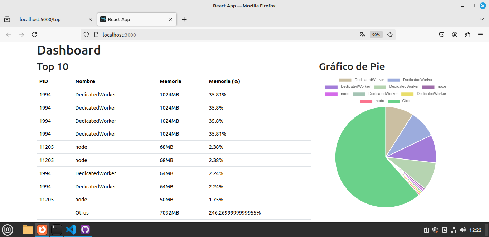
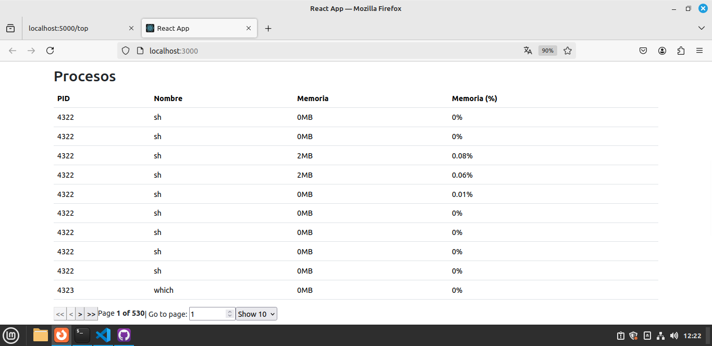
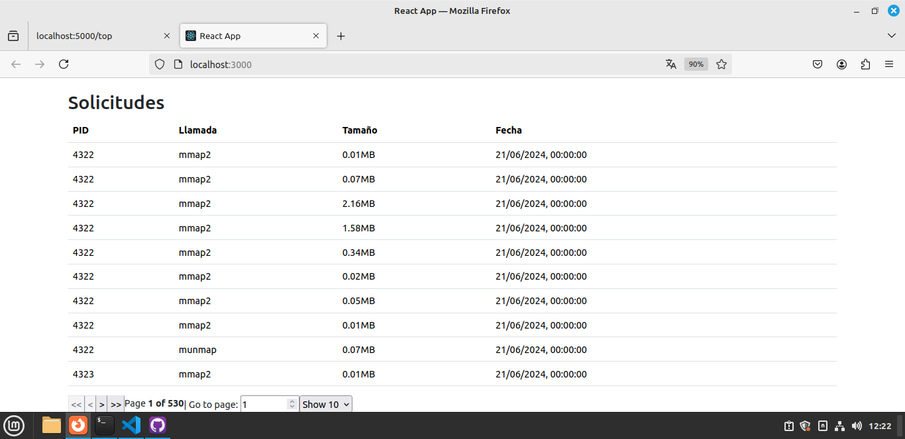

## Adicional para STAP

```
sudo apt-get update
sudo apt-get install systemtap
```

```s
sudo apt install systemtap linux-headers-$(uname -r)
```

### Verificación stap

`stap -V`

Ejecutar un .STP manualmente

`sudo stap nameSTP.stp`

## Ejecución del monitor

En caso de error con permisos de ejecución ejecutar:

```s
chmod +x run_memory_monitor.sh
```

luego se puede ejecutar con:

```s
./run_memory_monitor.sh
```

## MySQL

### Instalar MySQL
En este proyecto se utilizo mysql de forma local, por lo que necesitaremos instalarlo.Adicional

`sudo apt update`

`sudo apt install mysql-server`

En el siguiente comando ejecutar todo con "No" y hasta el último paso "Yes" (esto por fines del proyecto como tal):

`sudo mysql_secure_installation`

`sudo systemctl status mysql.service`

*Si el servicio no esta activo* `sudo systemctl start mysql.service`

### Crear base de datos

Ingresando a mysql (Enter en password ya que no tiene root)

`sudo mysql -u root -p`

#### Ejecutar Script de generación

`SHOW DATABASES;`

`SOURCE $PATH_SCRIPT.SQL$`

`SHOW DATABASES;`

### Descargar librería C-MySQL
luego de instalar mysql en linux mint correctamente, se instalaran las librerías para conectarse a MySQL desde C:

```sh
sudo apt-get install libmysqlclient-dev
```

## Evaluar resultados

Después de compilar y ejecutar el .bin generado por el file.C entonces se puede verificar el seteado a las tablas de la base de datos mediante:

Conectarse a la MySQL:

`sudo mysql -u root -p`

```mysql
mysql > SHOW DATABASES;
mysql > USE monitor;
mysql > SHOW TABLES;
mysql > SELECT * FROM LLAMADA;
mysql > SELECT * FROM PROCESO;
```


### Backend

1. **Instalación**

   Para instalar las dependencias del backend (Express), ejecuta los siguientes comandos desde la raíz del proyecto:

   ```bash
   cd backend
   npm install
   ```
2. **Ejecución**

    Para iniciar el servidor backend (Express), utiliza el siguiente comando
    ```bash
   npm start
   ```

### Frontend 

1. **Instalación**

   Para instalar las dependencias del frontend (React), ejecuta los siguientes comandos desde la raíz del proyecto:

   ```bash
   cd backend
   npm install
   ```
2. **Ejecución**

    Para iniciar la aplicación frontend (React), utiliza el siguiente comando:
    ```bash
   npm start
   ```

### Dashboard

El dashboard proporciona una visión detallada del sistema en tiempo real, organizado en las siguientes secciones:

### Top 10

Esta sección muestra los procesos con mayor consumo de memoria, destacando PID, nombre del proceso, tamaño de la memoria en MB y el porcentaje de memoria utilizado. La tabla se actualiza automáticamente cada 5 segundos para reflejar los cambios recientes en el sistema.


### Gráfico de Pie

El gráfico de pie visualiza la distribución del consumo de memoria entre los procesos principales. Cada segmento del gráfico representa un proceso específico y su porcentaje de uso de memoria. Este gráfico se actualiza automáticamente cada 5 segundos para mantener la visualización actualizada.




### Procesos

En esta sección se detallan todos los procesos en ejecución, mostrando PID, nombre del proceso, tamaño de la memoria en MB y el porcentaje de memoria que consumen. Al igual que las otras secciones, esta tabla se actualiza automáticamente cada 5 segundos para reflejar cualquier cambio en tiempo real.



### Solicitudes

La tabla de solicitudes registra las llamadas al backend junto con el tamaño de la solicitud y la fecha en que se realizó. Proporciona una trazabilidad útil de las interacciones recientes con el servidor. Esta tabla también se actualiza automáticamente cada 5 segundos para mostrar las nuevas solicitudes conforme se realizan.

